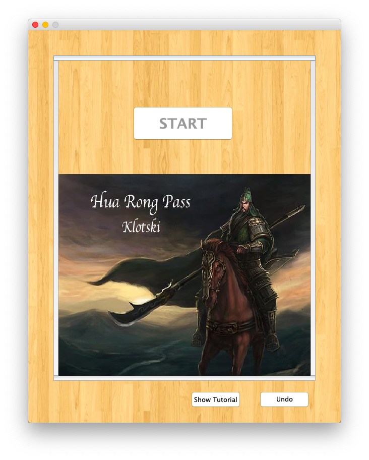
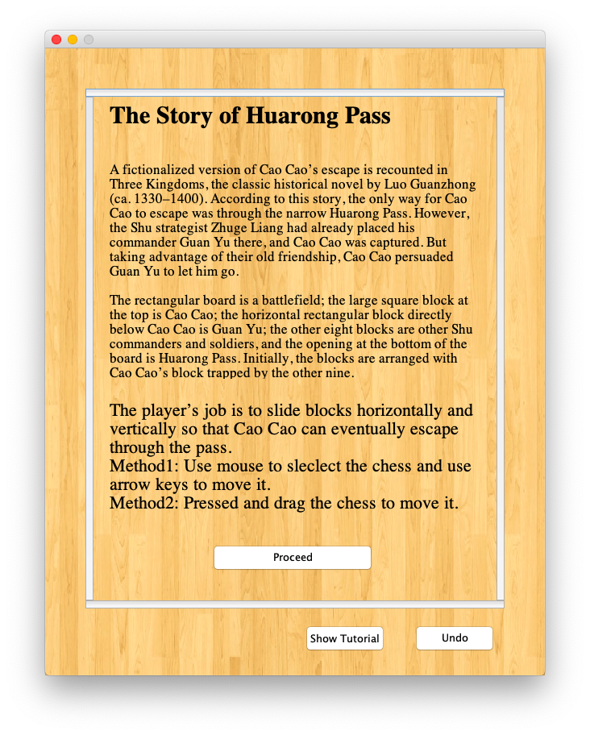
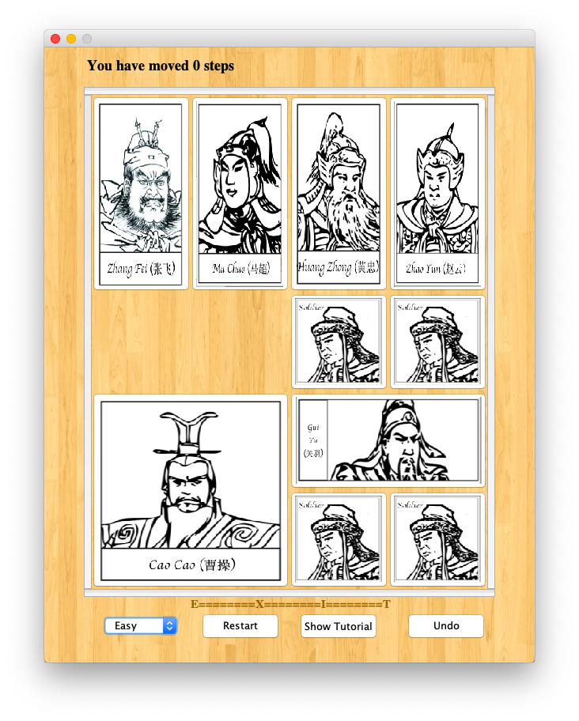
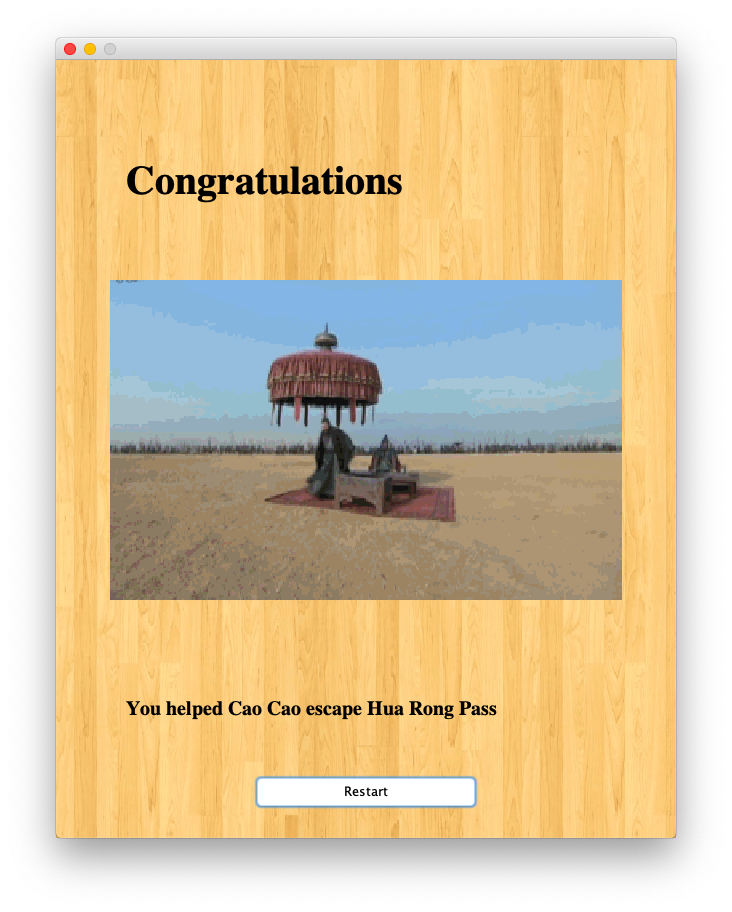

# Hua_Rong_Pass-Java-Program
A small Chinese Klotski game made with Java

This is a Chinese version of the well known Klotski Game, for which the aim is to move the 2x2 piece to the exit.

The historical background of the game trace back to the time of the Three Kingdoms, where the king of Wei Kingdom is defeated in a major battle. As he was fleeing, he encountered general "Guan Yu" from the Shu Kingdom right at the Hua Rong Pass. Nevertheless, the general let king Cao Cao go owing to a huge favor back in time.

The goal of the game is to move the 2x2 pieces of Cao Cao from the top of the game board to the bottom, where the exit is.

Game Features:
- Three different gaming difficulties
- A tutorial that could be of help
- Undo button
- Step counter

